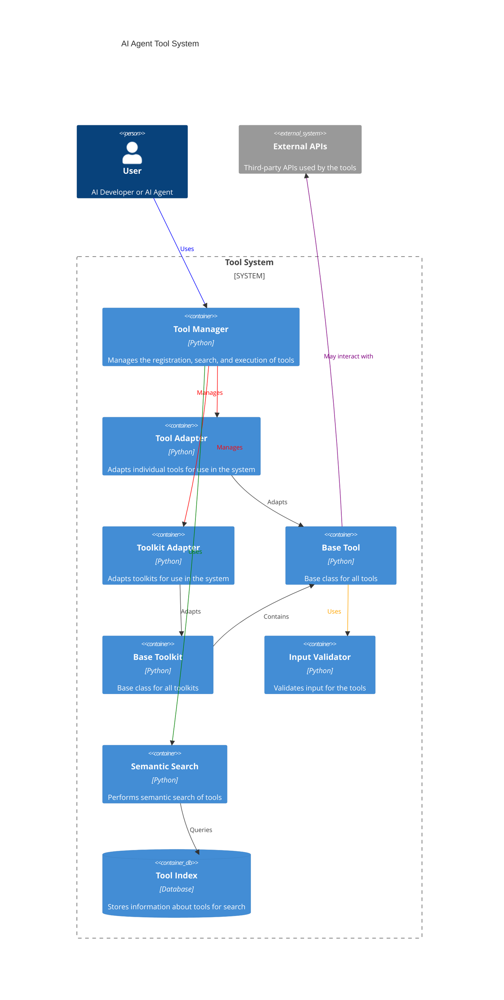

# Agent Omni Tool

## The Universal Agent Tools System Framework

Agent Omni Tool is a comprehensive framework designed to integrate, manage, and extend tools for AI agents. It provides
a universal system for creating, organizing, and utilizing a wide range of agent capabilities.

## Motivation

In the rapidly evolving field of AI, especially with the advent of large language models (LLMs) and multimodal AI
agents, there's a growing need for a standardized, flexible, and powerful way to create and manage tools that these
agents can use. Agent Omni Tool aims to fill this gap by providing a universal framework that allows developers to
easily create, integrate, and manage diverse tools for AI agents.

## Key Features

- **Universal Tool Integration:** Easily integrate any type of tool or functionality into AI agents.
- **Extensible Architecture:** Designed to be easily extended and customized for specific needs.
- **Standardized Interface:** Provides a consistent way to define and use tools across different AI agent
  implementations.
- **Asynchronous Execution:** Supports both synchronous and asynchronous tool execution for optimal performance.
- **Semantic Search:** Enables intelligent tool discovery based on natural language descriptions.
- **Version Management:** Built-in support for tool versioning to manage updates and backward compatibility.

## Architecture Overview

Agent Omni Tool is built on a modular and extensible architecture that allows for easy integration of new tools and
functionalities.



The framework consists of several key components:

1. **Tool Manager**: Central component for registering, discovering, and executing tools.
2. **Tool Adapters**: Wrappers around individual tools to standardize their interface and execution.
3. **Base Tool and Tool Kit**: Abstract base classes for creating individual tools and collections of related tools.
4. **Autodiscovery**: Mechanism for automatically discovering and registering tools in a specified directory.
5. **Semantic Search**: Component for finding relevant tools based on natural language descriptions.
6. **Input Validation**: Ensures that inputs to tools are valid before execution.

## How It Works


1. Tools are registered with the Tool Manager, either manually or through autodiscovery.
2. When an AI agent needs to use a tool, it requests it from the Tool Manager.
3. The Tool Manager finds the appropriate tool, either by name or through semantic search.
4. The tool's inputs are validated.
5. The tool is executed, either synchronously or asynchronously.
6. The result is returned to the AI agent.

## Sequence of Execution

[Here put the sequence diagram we created earlier]

This diagram illustrates the typical sequence of events when an AI agent uses a tool through the Agent Omni Tool
framework.

## Getting Started

### Installation

```bash
pip install agent-omni-tool
```

## Basic Usage

```python
from agent_omni_tool import setup_tools, BaseTool, BaseToolKit
```

### Configuration

```python 
tools_config = {
    "discover_path": "path/to/your/tools",
    "custom_tools": [YourCustomTool1, YourCustomTool2],
    "custom_toolkits": [YourCustomToolKit],
    "semantic_search": {
        "enabled": True,
        "index_path": "path/to/index"
    }
}

tool_manager = setup_tools(**tools_config)

```

## Creating a Custom Tool

Here's an example of how to create a custom tool:

```python

from agent_omni_tool import BaseTool
from pydantic import BaseModel, Field


class MyToolInput(BaseModel):
    param1: str = Field(..., description="Description of param1")
    param2: int = Field(..., description="Description of param2")


class MyCustomTool(BaseTool):
    def __init__(self):
        super().__init__("my_custom_tool", "Description of my custom tool", "1.0.0")
        self.set_input_schema(MyToolInput)

    def _sync_run(self, param1: str, param2: int):
        # Tool implementation here
        return f"Result: {param1}, {param2}"

```

```python

# Using a tool
result = tool_manager.get("my_custom_tool").execute(**tool_params)

```

## Event-Driven System

Agent Omni Tool incorporates a powerful event-driven system that enables comprehensive observability, instrumentation,
and extensibility. This system allows developers to hook into various stages of tool execution, providing opportunities
for logging, monitoring, and custom behavior implementation.

### Key Features of the Event System

- **Flexible Event Types:** Predefined event types cover the entire lifecycle of tool execution.
- **Callback Registration:** Multiple ways to register callbacks, including decorators and traditional methods.
- **Custom Callback Managers:** Ability to implement and use custom callback managers for specialized logging or
  instrumentation needs.

### Event Types

- `FUNCTION_CALL`: Triggered when a tool function is called.
- `FUNCTION_END`: Triggered when a tool function completes execution.
- `FUNCTION_ERROR`: Triggered when an error occurs during tool execution.

### Using the Event System

#### Registering Callbacks with Decorators

```python
from agent_omni_tool import ToolManager, CBEventType, Event, EventPayload

manager = ToolManager()


@manager.callback(event=CBEventType.FUNCTION_CALL)
def on_function_call(event: Event):
    print(f"Function called: {event.payload[EventPayload.TOOL]}")


@manager.callback(event=CBEventType.FUNCTION_END)
def on_function_end(event: Event):
    print(
        f"Function ended: {event.payload[EventPayload.TOOL]} with result: {event.payload[EventPayload.FUNCTION_OUTPUT]}")
```

#### Registering Callbacks with Traditional Methods

```python
def on_function_error(event: Event):
    print(f"Error in function: {event.payload[EventPayload.TOOL]} - {event.payload[EventPayload.ERROR]}")


manager.add_callback(CBEventType.FUNCTION_ERROR, on_function_error)
```

#### Removing Callbacks

```python
manager.remove_callback(CBEventType.FUNCTION_CALL, on_function_call)
```

### Custom Callback Managers

For advanced use cases, you can implement a custom callback manager:

```python

from agent_omni_tool import CallbackManagerInterface


class CustomCallbackManager(CallbackManagerInterface):
    def on_event(self, event: Event):
        # Custom logic for handling events
        pass

    @contextmanager
    def event(self, event_type: CBEventType, payload: Dict[EventPayload, Any]):
        # Custom logic for managing event context
        pass
```

#### Use the custom callback manager

```python

custom_manager = CustomCallbackManager()
tool_manager = ToolManager(callback_manager=custom_manager)

```

### Benefits of the Event System Integration

- **Observability:** Gain insights into tool usage, performance, and errors.
- **Instrumentation:** Easily integrate with monitoring and analytics systems.
- **Extensibility:** Add custom behaviors or integrations without modifying core code.
- **Debugging:** Simplify troubleshooting by logging detailed information about tool execution.
- **Performance Monitoring:** Track execution times and identify bottlenecks.

The event-driven system in Agent Omni Tool provides a flexible and powerful way to enhance your AI agent's capabilities,
offering deep insights into its operations and allowing for sophisticated integrations and customizations.

## Why Agent Omni Tool?

1. **Standardization:** Provides a consistent way to create and use tools across different AI agent implementations.
2. **Flexibility:** Can be used with any AI agent framework or custom implementation.
3. **Scalability:** Designed to handle a large number of tools efficiently.
4. **Ease of Use:** Simplifies the process of creating, integrating, and managing tools for AI agents.
5. **Future-Proof:** Extensible architecture allows for easy adaptation to future developments in AI and tool
   requirements.

# Contributing

We welcome contributions! Please see our Contributing Guidelines for more details.

# License

Agent Omni Tool is released under the MIT License. See the LICENSE file for more details.